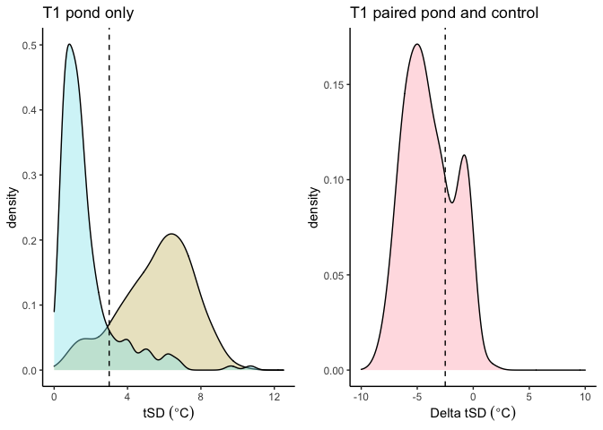
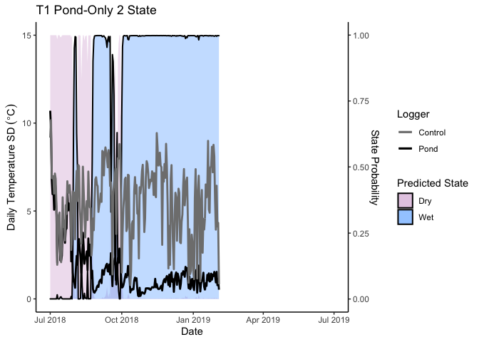
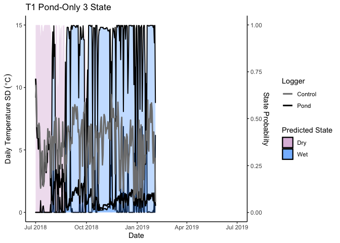
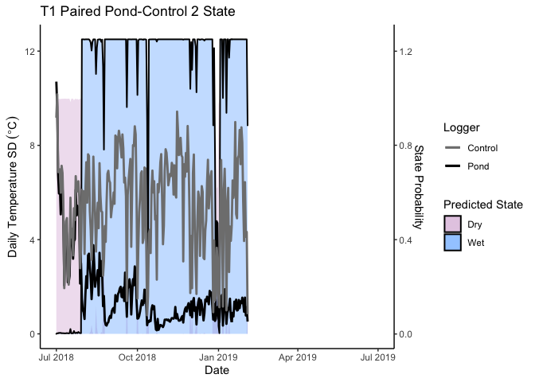
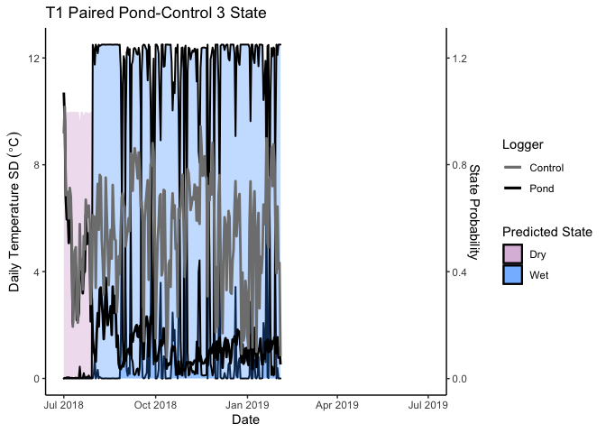
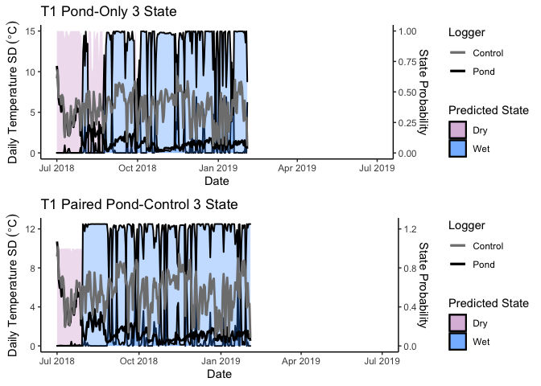

Prediction of Pond Inundation States Using Hidden Markov Models
================
Kerry L. Gendreau
1/17/2021

## Table of Contents

1.  Introduction
2.  Code for processing raw data files and summarizing daily temperature means and standard deviations
3.  Code for fitting Hidden Markov Models to daily temperature standard deviations
    -   3.1. Pond-Only dataset
    -   3.2. Paired Pond-Control dataset
    -   3.3. Comparison of datasets

## 1. Introduction

This code fits Hidden Markov models to readings of daily temperature standard deviations (tSD) to estimate pond inundation timing.

In Section 2, raw iButton logger data is used as an input to calculate tSDs.

In Section 3, following manual adjustment of this output file from Section 2 (described below), these tSDs can be used to estimate pond inundation with Hidden Markov models. Hidden Markov models are fitted to data from the pond logger only (Section 3.1) and to delta tSDs calculated by subtracting control logger tSDs (measured from a logger placed outside of the pond) from the pond logger tSDs (measured from within the pond; Section 3.2). The results from the datasets are compared in Section 3.3.

#### Abbreviations:

-   **tSD** - Daily temperature standard deviation
-   **HMM** - Hidden Markov model

## 2. Code for processing raw data files and summarizing daily temperature means and standard deviations

This section of code was written by Valerie Buxton and modified by Kerry Gendreau. It is adapted from Anderson et al (2015).

``` r
rm(list=ls()) 
require(zoo)
```

    ## Loading required package: zoo

    ## 
    ## Attaching package: 'zoo'

    ## The following objects are masked from 'package:base':
    ## 
    ##     as.Date, as.Date.numeric

``` r
require(plyr)
```

    ## Loading required package: plyr

List all iButton raw files.

``` r
setwd("~/Desktop/Mims_Lab/Pond_temperature_files")
filelist=list.files(path="~/Desktop/Mims_Lab/Pond_temperature_files/",pattern = "\\.csv$", full.names=TRUE)
hobo.names<-list.files(path="~/Desktop/Mims_Lab/Pond_temperature_files/",pattern = "\\.csv$") 
```

Clear output directories.

``` r
setwd("~/Desktop/Mims_Lab/Pond_temperature_files")
invisible(suppressWarnings(do.call(file.remove,list(list.files("~/Desktop/Mims_Lab/Pond_temperature_files/SD_output/", full.names=TRUE,recursive=TRUE )))))
```

Calculate tSD for each day and write to files. This will produce individual .csv files for each pond containing one line for each date as well as a plot of average daily temperature standard deviations for each pond.

Note: if you want to calculate mean daily temperatures or daily temperature variance, just change the function ("FUN") and the names of the output files to reflect this.

``` r
setwd("~/Desktop/Mims_Lab/Pond_temperature_files")
cnt=0 #Counter
for(i in filelist){
  cnt=cnt+1
  hobo<-read.csv(i, skip=2,stringsAsFactors=FALSE)[,1:2]
  colnames(hobo)[1] <- "Date.Time"
  colnames(hobo)[2] <- "Value"
  times = as.POSIXct(strptime(substr(hobo$Date.Time,1,40),format = '%m/%d/%y %H:%M'))
  Time <- as.character(substr(times,12,19))
  Date <- as.Date(substr(times,1,10))
  hobo$Time <- Time
  hobo$Date <- Date
  hobo.v <- aggregate(Value~Date,FUN=sd,data=hobo)
  NAME<-gsub(".csv","",x=hobo.names[cnt])
  
  {pdf(paste("~/Desktop/Mims_Lab/Pond_temperature_files/SD_output/",NAME,".pdf",sep=""))
    plot(hobo.v$Date,hobo.v$Value,xlab="Date",ylab="Mean daily temp SD",main=paste(NAME)) #get plots of each
    dev.off()}
  Export.File<-paste("~/Desktop/Mims_Lab/Pond_temperature_files/SD_output/",NAME,".csv",sep="")
  write.table(x=hobo.v,Export.File,sep=",",row.names=F,col.names=T)
}
```

The names of these output files reflect the logger id numbers. We manually changed the names of the files to reflect the pond names (e.g. T1\_pond, T1\_control, T2\_pond, ... etc.) and combined them into one csv file with one row for each day and one column for each logger. We used this file for downstream analyses.

## 3. Code for fitting Hidden Markov Models to daily temperature standard deviations

This section of code was written by Kerry Gendreau.

Load required packages (you may need to install one or more of these first).

``` r
library(depmixS4)
```

    ## Loading required package: nnet

    ## Loading required package: MASS

    ## Loading required package: Rsolnp

    ## Loading required package: nlme

``` r
library(ggplot2)
library(reshape)
```

    ## 
    ## Attaching package: 'reshape'

    ## The following objects are masked from 'package:plyr':
    ## 
    ##     rename, round_any

``` r
library(cowplot)
```

    ## 
    ## Attaching package: 'cowplot'

    ## The following object is masked from 'package:reshape':
    ## 
    ##     stamp

``` r
library(rlist)
library(DescTools)
library(gt)
```

Set the working directory to the directory containing your processed data files. Read in the data sets containing tSDs and average daily temperatures (calculated from raw logger data using python script).

``` r
setwd("~/Desktop/Mims_Lab/")
master<-read.csv("SD_all_ponds_combined_Nov2019.csv", header=TRUE)
Date <- as.Date(master$Date, format="%m/%d/%y")
TSData <-data.frame(master[,2:29], row.names=as.Date(Date, format="%m/%d/%y"))
TSData$Date <- as.Date(master$Date, format="%m/%d/%y")
mean_temp<-read.csv("Mean_temperature_all_ponds_Nov2019.csv", header=TRUE) 
mean_temp_data <- data.frame(mean_temp[,2:27], row.names=Date)
```

Adjust dates for the loggers that failed and calculate delta temperature standard deviation values for pond-control datasets.

``` r
T1_dataset <- data.frame(TSData$T1_pond[1:218])
T1_dataset$T1_control <- TSData$T1_control[1:218]
T1_dataset$Date <- as.Date(row.names(TSData)[1:218],format="%Y-%m-%d") 
T1_dataset$T1_sd_differences <- T1_dataset$TSData.T1_pond.1.218. - T1_dataset$T1_control
colnames(T1_dataset)[1] <- "T1_pond"


T2_dataset <- data.frame(TSData$T2_pond[1:174])
T2_dataset$T2_control <- TSData$T2_control[1:174]
T2_dataset$Date <- as.Date(row.names(TSData)[1:174],format="%Y-%m-%d") 
T2_dataset$T2_sd_differences <- T2_dataset$TSData.T2_pond.1.174. - T2_dataset$T2_control
colnames(T2_dataset)[1] <- "T2_pond"

TSData$T4_sd_differences <- TSData$T4_pond - TSData$T4_control

T8_dataset <- data.frame(TSData$T8_pond[1:198])
T8_dataset$T8_control <- TSData$T8_control[1:198]
T8_dataset$Date <- as.Date(row.names(TSData)[1:198],format="%Y-%m-%d") 
T8_dataset$T8_sd_differences <- T8_dataset$TSData.T8_pond.1.198. - T8_dataset$T8_control
colnames(T8_dataset)[1] <- "T8_pond"

T15U_dataset <- data.frame(TSData$T15U_pond[1:304])
T15U_dataset$T8_control <- TSData$T15U_control[1:304]
T15U_dataset$Date <- as.Date(row.names(TSData)[1:304],format="%Y-%m-%d") 
colnames(T15U_dataset)[1] <- "T15U_pond"
colnames(T15U_dataset)[2] <- "T15U_control"

TSData$T9_sd_differences <- TSData$T9_pond - TSData$T9_control

TSData$T11_sd_differences <- TSData$T11_pond - TSData$T11_control

TSData$T12_sd_differences <- TSData$T12_pond - TSData$T12_control

T13_dataset <- data.frame(TSData$T13_pond[1:308])
T13_dataset$T13_control <- TSData$T13_control[1:308]
T13_dataset$Date <- as.Date(row.names(TSData)[1:308],format="%Y-%m-%d") 
names(T13_dataset)[1] <- "T13_pond"
T13_dataset$T13_sd_differences <- T13_dataset$T13_pond - T13_dataset$T13_control

TSData$T15D_sd_differences <- TSData$T15D_pond - TSData$T15D_control

TSData$T15U_sd_differences <- TSData$T15U_pond - TSData$T15U_control

TSData$T17_sd_differences <- TSData$T17_pond - TSData$T17_control

TSData$T19_sd_differences <- TSData$T19_pond - TSData$T19_control

TSData$T20_sd_differences <- TSData$T20_pond - TSData$T20_control

TSData$A14_sd_differences <- TSData$A14_pond - TSData$A14_control
```

Plot histograms of the tSDs.

``` r
T1_hist_df <- data.frame("Control"=T1_dataset$T1_control, "Pond"=T1_dataset$T1_pond)
T1_hist_df_m <- melt(T1_hist_df)
```

    ## Using  as id variables

``` r
T1_SD_hist <- ggplot(T1_hist_df_m, aes(x=value, fill=variable)) +
  geom_density(alpha=0.4) +
  theme_classic() +
  xlim(c(0,12.5)) +
  xlab(expression("tSD " ( degree*C))) +
  scale_fill_manual(values = c("lightgoldenrod3", "cadetblue2"), guide=FALSE) +
  geom_vline(xintercept = 3, linetype="dashed") +
  ggtitle("T1 pond only")

T1_delta_hist_df <- data.frame("Delta"=T1_dataset$T1_pond-T1_dataset$T1_control)

T1_SD_hist_delta <- ggplot(T1_delta_hist_df, aes(x=Delta, fill="Delta SD")) +
  geom_density(alpha=0.4) +
  theme_classic() +
  xlim(c(-10,10)) +
  xlab(expression("Delta tSD " ( degree*C))) +
  geom_vline(xintercept = -2.5, linetype="dashed") +
  scale_fill_manual(values = c("lightpink1"), guide=FALSE) +
  ggtitle("T1 paired pond and control")

plot_grid(T1_SD_hist, T1_SD_hist_delta, nrow=1,ncol=2)
```



### 3.1. Pond-Only dataset

Fit a 2-state Hidden Markov Model to the pond-only dataset and plot the results

``` r
set.seed(1)
HMM_siteT1_2st <-depmix(T1_dataset$T1_pond~1, data=T1_dataset, nstates=2, family=gaussian())
HMM_fitT1_2st <-fit(HMM_siteT1_2st, verbose=FALSE)
```

    ## converged at iteration 21 with logLik: -242.0736

``` r
HMM_post_T1_2st <- posterior(HMM_fitT1_2st)
summary(HMM_fitT1_2st)
```

    ## Initial state probabilities model 
    ## pr1 pr2 
    ##   0   1 
    ## 
    ## Transition matrix 
    ##         toS1  toS2
    ## fromS1 0.987 0.013
    ## fromS2 0.048 0.952
    ## 
    ## Response parameters 
    ## Resp 1 : gaussian 
    ##     Re1.(Intercept) Re1.sd
    ## St1           0.988  0.444
    ## St2           3.433  1.922

``` r
T1_pond_df_2st <- data.frame("Date" = T1_dataset$Date, "Difference" = T1_dataset$T1_sd_differences, "Temperature Variance" = T1_dataset$T1_pond, "Wet" = HMM_post_T1_2st$S1, "Dry" =  HMM_post_T1_2st$S2)

T1_plot_2st <- ggplot(T1_pond_df_2st, aes(x=Date)) +
  geom_area(aes(y=Dry*15, fill="Dry")) +
  geom_area(size=0.7,linetype=1, colour="black", aes(y=Wet*15, fill="Wet")) +
  scale_x_date(limits = as.Date(c("2018-07-01", "2019-07-01"))) +
  scale_y_continuous(sec.axis = sec_axis(~./15, name = "State Probability")) +
  scale_fill_manual(values = alpha(c("#CC99CC", "#3399FF"), 0.3), guide=guide_legend(title="Predicted State")) +
  geom_line(size=1, aes(y=Temperature.Variance, colour="Pond")) + 
  geom_line(size=1, aes(y=T1_dataset$T1_control, colour="Control")) + 
  scale_colour_manual(values = c("grey50","black"), guide=guide_legend(title="Logger")) +
  labs(y = expression("Daily Temperature SD " ( degree*C)), x = "Date", colour = "Parameter") +
  theme(axis.title.x=element_blank()) +
  theme(axis.title.y = element_blank()) +
  theme(legend.position = "top") + 
  theme_classic() +
  ggtitle("T1 Pond-Only 2 State")

T1_plot_2st
```



Fit a 3-state Hidden Markov Model to the pond-only dataset and plot the results.

``` r
set.seed(1)
HMM_siteT1 <-depmix(T1_dataset$T1_pond~1, data=T1_dataset, nstates=3, family=gaussian())
HMM_fitT1 <-fit(HMM_siteT1, verbose=FALSE)
```

    ## converged at iteration 42 with logLik: -203.3375

``` r
HMM_post_T1 <- posterior(HMM_fitT1)
summary(HMM_fitT1)
```

    ## Initial state probabilities model 
    ## pr1 pr2 pr3 
    ##   1   0   0 
    ## 
    ## Transition matrix 
    ##         toS1  toS2  toS3
    ## fromS1 0.941 0.000 0.059
    ## fromS2 0.000 0.867 0.133
    ## fromS3 0.018 0.059 0.923
    ## 
    ## Response parameters 
    ## Resp 1 : gaussian 
    ##     Re1.(Intercept) Re1.sd
    ## St1           3.763  1.921
    ## St2           0.538  0.165
    ## St3           1.243  0.422

``` r
T1_pond_df <- data.frame("Date" = T1_dataset$Date, "Difference" = T1_dataset$T1_sd_differences, "Temperature Variance" = T1_dataset$T1_pond, "Wet" = HMM_post_T1$S2, "Wet2" = HMM_post_T1$S3, "Dry" =  HMM_post_T1$S1)


T1_plot <- ggplot(T1_pond_df, aes(x=Date)) +
  geom_area(aes(y=Dry*15, fill="Dry")) +
  geom_area(size=0.7,linetype=1, colour="black",aes(y=Wet*15, fill="Wet")) +
  geom_area(size=0.7,linetype=1, colour="black", aes(y=Wet2*15, fill="Wet")) +
  scale_x_date(limits = as.Date(c("2018-07-01", "2019-07-01"))) +
  scale_y_continuous(sec.axis = sec_axis(~./15, name = "State Probability")) +
  scale_fill_manual(values = alpha(c("#CC99CC", "#3399FF"), 0.3), guide=guide_legend(title="Predicted State")) +
  geom_line(size=1, aes(y=Temperature.Variance, colour="Pond")) + 
  geom_line(size=1, aes(y=T1_dataset$T1_control, colour="Control")) + 
  scale_colour_manual(values = c("grey50","black"), guide=guide_legend(title="Logger")) +
  labs(y = expression("Daily Temperature SD " ( degree*C)), x = "Date", colour = "Parameter") +
  theme(axis.title.x=element_blank()) +
  theme(axis.title.y = element_blank()) +
  theme(legend.position = "top") + 
  theme_classic() +
  ggtitle("T1 Pond-Only 3 State")

T1_plot
```



Calculate the mean and standard deviations of tSDs for each predicted state from the pond-only 3-state HMM (values in Table S3 of manuscript).

<!--html_preserve-->
<style>html {
  font-family: -apple-system, BlinkMacSystemFont, 'Segoe UI', Roboto, Oxygen, Ubuntu, Cantarell, 'Helvetica Neue', 'Fira Sans', 'Droid Sans', Arial, sans-serif;
}

#phcyqariyx .gt_table {
  display: table;
  border-collapse: collapse;
  margin-left: auto;
  margin-right: auto;
  color: #333333;
  font-size: 16px;
  font-weight: normal;
  font-style: normal;
  background-color: #FFFFFF;
  width: auto;
  border-top-style: solid;
  border-top-width: 2px;
  border-top-color: #A8A8A8;
  border-right-style: none;
  border-right-width: 2px;
  border-right-color: #D3D3D3;
  border-bottom-style: solid;
  border-bottom-width: 2px;
  border-bottom-color: #A8A8A8;
  border-left-style: none;
  border-left-width: 2px;
  border-left-color: #D3D3D3;
}

#phcyqariyx .gt_heading {
  background-color: #FFFFFF;
  text-align: center;
  border-bottom-color: #FFFFFF;
  border-left-style: none;
  border-left-width: 1px;
  border-left-color: #D3D3D3;
  border-right-style: none;
  border-right-width: 1px;
  border-right-color: #D3D3D3;
}

#phcyqariyx .gt_title {
  color: #333333;
  font-size: 125%;
  font-weight: initial;
  padding-top: 4px;
  padding-bottom: 4px;
  border-bottom-color: #FFFFFF;
  border-bottom-width: 0;
}

#phcyqariyx .gt_subtitle {
  color: #333333;
  font-size: 85%;
  font-weight: initial;
  padding-top: 0;
  padding-bottom: 4px;
  border-top-color: #FFFFFF;
  border-top-width: 0;
}

#phcyqariyx .gt_bottom_border {
  border-bottom-style: solid;
  border-bottom-width: 2px;
  border-bottom-color: #D3D3D3;
}

#phcyqariyx .gt_col_headings {
  border-top-style: solid;
  border-top-width: 2px;
  border-top-color: #D3D3D3;
  border-bottom-style: solid;
  border-bottom-width: 2px;
  border-bottom-color: #D3D3D3;
  border-left-style: none;
  border-left-width: 1px;
  border-left-color: #D3D3D3;
  border-right-style: none;
  border-right-width: 1px;
  border-right-color: #D3D3D3;
}

#phcyqariyx .gt_col_heading {
  color: #333333;
  background-color: #FFFFFF;
  font-size: 100%;
  font-weight: normal;
  text-transform: inherit;
  border-left-style: none;
  border-left-width: 1px;
  border-left-color: #D3D3D3;
  border-right-style: none;
  border-right-width: 1px;
  border-right-color: #D3D3D3;
  vertical-align: bottom;
  padding-top: 5px;
  padding-bottom: 6px;
  padding-left: 5px;
  padding-right: 5px;
  overflow-x: hidden;
}

#phcyqariyx .gt_column_spanner_outer {
  color: #333333;
  background-color: #FFFFFF;
  font-size: 100%;
  font-weight: normal;
  text-transform: inherit;
  padding-top: 0;
  padding-bottom: 0;
  padding-left: 4px;
  padding-right: 4px;
}

#phcyqariyx .gt_column_spanner_outer:first-child {
  padding-left: 0;
}

#phcyqariyx .gt_column_spanner_outer:last-child {
  padding-right: 0;
}

#phcyqariyx .gt_column_spanner {
  border-bottom-style: solid;
  border-bottom-width: 2px;
  border-bottom-color: #D3D3D3;
  vertical-align: bottom;
  padding-top: 5px;
  padding-bottom: 6px;
  overflow-x: hidden;
  display: inline-block;
  width: 100%;
}

#phcyqariyx .gt_group_heading {
  padding: 8px;
  color: #333333;
  background-color: #FFFFFF;
  font-size: 100%;
  font-weight: initial;
  text-transform: inherit;
  border-top-style: solid;
  border-top-width: 2px;
  border-top-color: #D3D3D3;
  border-bottom-style: solid;
  border-bottom-width: 2px;
  border-bottom-color: #D3D3D3;
  border-left-style: none;
  border-left-width: 1px;
  border-left-color: #D3D3D3;
  border-right-style: none;
  border-right-width: 1px;
  border-right-color: #D3D3D3;
  vertical-align: middle;
}

#phcyqariyx .gt_empty_group_heading {
  padding: 0.5px;
  color: #333333;
  background-color: #FFFFFF;
  font-size: 100%;
  font-weight: initial;
  border-top-style: solid;
  border-top-width: 2px;
  border-top-color: #D3D3D3;
  border-bottom-style: solid;
  border-bottom-width: 2px;
  border-bottom-color: #D3D3D3;
  vertical-align: middle;
}

#phcyqariyx .gt_from_md > :first-child {
  margin-top: 0;
}

#phcyqariyx .gt_from_md > :last-child {
  margin-bottom: 0;
}

#phcyqariyx .gt_row {
  padding-top: 8px;
  padding-bottom: 8px;
  padding-left: 5px;
  padding-right: 5px;
  margin: 10px;
  border-top-style: solid;
  border-top-width: 1px;
  border-top-color: #D3D3D3;
  border-left-style: none;
  border-left-width: 1px;
  border-left-color: #D3D3D3;
  border-right-style: none;
  border-right-width: 1px;
  border-right-color: #D3D3D3;
  vertical-align: middle;
  overflow-x: hidden;
}

#phcyqariyx .gt_stub {
  color: #333333;
  background-color: #FFFFFF;
  font-size: 100%;
  font-weight: initial;
  text-transform: inherit;
  border-right-style: solid;
  border-right-width: 2px;
  border-right-color: #D3D3D3;
  padding-left: 12px;
}

#phcyqariyx .gt_summary_row {
  color: #333333;
  background-color: #FFFFFF;
  text-transform: inherit;
  padding-top: 8px;
  padding-bottom: 8px;
  padding-left: 5px;
  padding-right: 5px;
}

#phcyqariyx .gt_first_summary_row {
  padding-top: 8px;
  padding-bottom: 8px;
  padding-left: 5px;
  padding-right: 5px;
  border-top-style: solid;
  border-top-width: 2px;
  border-top-color: #D3D3D3;
}

#phcyqariyx .gt_grand_summary_row {
  color: #333333;
  background-color: #FFFFFF;
  text-transform: inherit;
  padding-top: 8px;
  padding-bottom: 8px;
  padding-left: 5px;
  padding-right: 5px;
}

#phcyqariyx .gt_first_grand_summary_row {
  padding-top: 8px;
  padding-bottom: 8px;
  padding-left: 5px;
  padding-right: 5px;
  border-top-style: double;
  border-top-width: 6px;
  border-top-color: #D3D3D3;
}

#phcyqariyx .gt_striped {
  background-color: rgba(128, 128, 128, 0.05);
}

#phcyqariyx .gt_table_body {
  border-top-style: solid;
  border-top-width: 2px;
  border-top-color: #D3D3D3;
  border-bottom-style: solid;
  border-bottom-width: 2px;
  border-bottom-color: #D3D3D3;
}

#phcyqariyx .gt_footnotes {
  color: #333333;
  background-color: #FFFFFF;
  border-bottom-style: none;
  border-bottom-width: 2px;
  border-bottom-color: #D3D3D3;
  border-left-style: none;
  border-left-width: 2px;
  border-left-color: #D3D3D3;
  border-right-style: none;
  border-right-width: 2px;
  border-right-color: #D3D3D3;
}

#phcyqariyx .gt_footnote {
  margin: 0px;
  font-size: 90%;
  padding: 4px;
}

#phcyqariyx .gt_sourcenotes {
  color: #333333;
  background-color: #FFFFFF;
  border-bottom-style: none;
  border-bottom-width: 2px;
  border-bottom-color: #D3D3D3;
  border-left-style: none;
  border-left-width: 2px;
  border-left-color: #D3D3D3;
  border-right-style: none;
  border-right-width: 2px;
  border-right-color: #D3D3D3;
}

#phcyqariyx .gt_sourcenote {
  font-size: 90%;
  padding: 4px;
}

#phcyqariyx .gt_left {
  text-align: left;
}

#phcyqariyx .gt_center {
  text-align: center;
}

#phcyqariyx .gt_right {
  text-align: right;
  font-variant-numeric: tabular-nums;
}

#phcyqariyx .gt_font_normal {
  font-weight: normal;
}

#phcyqariyx .gt_font_bold {
  font-weight: bold;
}

#phcyqariyx .gt_font_italic {
  font-style: italic;
}

#phcyqariyx .gt_super {
  font-size: 65%;
}

#phcyqariyx .gt_footnote_marks {
  font-style: italic;
  font-size: 65%;
}
</style>
<table class="gt_table">
<thead class="gt_header">
    <tr>
      <th colspan="5" class="gt_heading gt_title gt_font_normal" style>3-State HMM Summary</th>
    </tr>
    <tr>
      <th colspan="5" class="gt_heading gt_subtitle gt_font_normal gt_bottom_border" style>Pond-Only T1</th>
    </tr>

</thead>
<thead class="gt_col_headings">
    <tr>
      <th class="gt_col_heading gt_columns_bottom_border gt_left" rowspan="1" colspan="1">state</th>
      <th class="gt_col_heading gt_columns_bottom_border gt_right" rowspan="1" colspan="1">pond_mean</th>
      <th class="gt_col_heading gt_columns_bottom_border gt_right" rowspan="1" colspan="1">pond_sd</th>
      <th class="gt_col_heading gt_columns_bottom_border gt_right" rowspan="1" colspan="1">control_mean</th>
      <th class="gt_col_heading gt_columns_bottom_border gt_right" rowspan="1" colspan="1">control_sd</th>
    </tr>

</thead>
<tbody class="gt_table_body">
    <tr>
      <td class="gt_row gt_left">Wet</td>
      <td class="gt_row gt_right">0.526875</td>
      <td class="gt_row gt_right">0.1616044</td>
      <td class="gt_row gt_right">5.981352</td>
      <td class="gt_row gt_right">1.863287</td>
    </tr>
    <tr>
      <td class="gt_row gt_left">Wet2</td>
      <td class="gt_row gt_right">1.223412</td>
      <td class="gt_row gt_right">0.4266863</td>
      <td class="gt_row gt_right">5.431524</td>
      <td class="gt_row gt_right">2.059035</td>
    </tr>
    <tr>
      <td class="gt_row gt_left">Dry</td>
      <td class="gt_row gt_right">3.804670</td>
      <td class="gt_row gt_right">1.9253513</td>
      <td class="gt_row gt_right">5.636200</td>
      <td class="gt_row gt_right">1.852994</td>
    </tr>

</tbody>
</table>

<!--/html_preserve-->
### 3.2. Paired Pond-Control dataset

Fit a 2-state Hidden Markov Model to the paired pond-control dataset and plot the results

``` r
set.seed(1)
HMM_siteT1_difference_2st <- depmix(T1_dataset$T1_sd_differences~1, data=T1_dataset, nstates=2, family=gaussian())
HMM_fitT1_difference_2st <- fit(HMM_siteT1_difference_2st, verbose=FALSE)
```

    ## converged at iteration 68 with logLik: -414.074

``` r
HMM_post_T1_difference_2st <- posterior(HMM_fitT1_difference_2st)

summary(HMM_fitT1_difference_2st)
```

    ## Initial state probabilities model 
    ## pr1 pr2 
    ##   1   0 
    ## 
    ## Transition matrix 
    ##         toS1  toS2
    ## fromS1 0.931 0.069
    ## fromS2 0.010 0.990
    ## 
    ## Response parameters 
    ## Resp 1 : gaussian 
    ##     Re1.(Intercept) Re1.sd
    ## St1          -0.694  0.702
    ## St2          -4.563  1.763

``` r
T1_difference_df_2st <- data.frame("Date" = T1_dataset$Date, "Difference" = T1_dataset$T1_sd_differences, "Temperature Variance" = T1_dataset$T1_pond, "Wet" = HMM_post_T1_difference_2st$S2, "Dry" = HMM_post_T1_difference_2st$S1)


T1_differences_plot_2st <- ggplot(T1_difference_df_2st, aes(x=Date)) +
  geom_area(aes(y=Dry*10, fill="Dry")) +
  geom_area(size=0.7,linetype=1,colour="black", aes(y=Wet*12.5, fill="Wet")) +
  scale_x_date(limits = as.Date(c("2018-07-01", "2019-07-01"))) +
  scale_y_continuous(sec.axis = sec_axis(~./10, name = "State Probability")) +
  scale_fill_manual(values = alpha(c("#CC99CC","#3399FF"), 0.3), guide=guide_legend(title="Predicted State")) +
  geom_line(size=1, aes(y=Temperature.Variance, colour="Pond")) + 
  geom_line(size=1, aes(y=T1_dataset$T1_control, colour="Control")) + 
  scale_colour_manual(values = c("grey50","black"), guide=guide_legend(title="Logger")) +  labs(y = expression("Daily Temperature SD " ( degree*C)), x = "Date", colour = "Parameter") +
  theme(axis.title.x=element_blank()) +
  theme(axis.title.y = element_blank()) +
  theme(legend.position = "top") + 
  theme_classic() +
  ggtitle("T1 Paired Pond-Control 2 State")


T1_differences_plot_2st
```



Fit a 3-state Hidden Markov Model to the paired pond-control dataset and plot the results.

``` r
set.seed(1)
HMM_siteT1_difference <- depmix(T1_dataset$T1_sd_differences~1, data=T1_dataset, nstates=3, family=gaussian())
HMM_fitT1_difference <- fit(HMM_siteT1_difference, verbose=FALSE)
```

    ## converged at iteration 71 with logLik: -376.1116

``` r
HMM_post_T1_difference <- posterior(HMM_fitT1_difference)

summary(HMM_fitT1_difference)
```

    ## Initial state probabilities model 
    ## pr1 pr2 pr3 
    ##   0   0   1 
    ## 
    ## Transition matrix 
    ##         toS1  toS2  toS3
    ## fromS1 0.858 0.142 0.000
    ## fromS2 0.062 0.938 0.000
    ## fromS3 0.000 0.035 0.965
    ## 
    ## Response parameters 
    ## Resp 1 : gaussian 
    ##     Re1.(Intercept) Re1.sd
    ## St1          -6.374  0.783
    ## St2          -3.567  1.522
    ## St3          -0.524  0.561

``` r
T1_difference_df <- data.frame("Date" = T1_dataset$Date, "Difference" = T1_dataset$T1_sd_differences, "Temperature Variance" = T1_dataset$T1_pond, "Wet" = HMM_post_T1_difference$S1, "Wet2" = HMM_post_T1_difference$S2, "Dry" =  HMM_post_T1_difference$S3)


T1_differences_plot <- ggplot(T1_difference_df, aes(x=Date)) +
  geom_area(aes(y=Dry*10, fill="Dry")) +
  geom_area(size=0.7,linetype=1,colour="black", aes(y=Wet*12.5, fill="Wet")) +
  geom_area(size=0.7,linetype=1, colour="black", aes(y=Wet2*12.5, fill="Wet")) +
  scale_x_date(limits = as.Date(c("2018-07-01", "2019-07-01"))) +
  scale_y_continuous(sec.axis = sec_axis(~./10, name = "State Probability")) +
  scale_fill_manual(values = alpha(c("#CC99CC", "#3399FF"), 0.3), guide=guide_legend(title="Predicted State")) +
  geom_line(size=1, aes(y=Temperature.Variance, colour="Pond")) + 
  geom_line(size=1, aes(y=T1_dataset$T1_control, colour="Control")) + 
  scale_colour_manual(values = c("grey50","black"), guide=guide_legend(title="Logger")) +  labs(y = expression("Daily Temperature SD " ( degree*C)), x = "Date", colour = "Parameter") +
  theme(axis.title.x=element_blank()) +
  theme(axis.title.y = element_blank()) +
  theme(legend.position = "top") + 
  theme_classic() +
  ggtitle("T1 Paired Pond-Control 3 State")

T1_differences_plot
```



Calculate the mean and standard deviations of tSDs for each predicted state from the paired pond-control 3-state HMM (values in Table S3 of manuscript).

<!--html_preserve-->
<style>html {
  font-family: -apple-system, BlinkMacSystemFont, 'Segoe UI', Roboto, Oxygen, Ubuntu, Cantarell, 'Helvetica Neue', 'Fira Sans', 'Droid Sans', Arial, sans-serif;
}

#phcyqariyx .gt_table {
  display: table;
  border-collapse: collapse;
  margin-left: auto;
  margin-right: auto;
  color: #333333;
  font-size: 16px;
  font-weight: normal;
  font-style: normal;
  background-color: #FFFFFF;
  width: auto;
  border-top-style: solid;
  border-top-width: 2px;
  border-top-color: #A8A8A8;
  border-right-style: none;
  border-right-width: 2px;
  border-right-color: #D3D3D3;
  border-bottom-style: solid;
  border-bottom-width: 2px;
  border-bottom-color: #A8A8A8;
  border-left-style: none;
  border-left-width: 2px;
  border-left-color: #D3D3D3;
}

#phcyqariyx .gt_heading {
  background-color: #FFFFFF;
  text-align: center;
  border-bottom-color: #FFFFFF;
  border-left-style: none;
  border-left-width: 1px;
  border-left-color: #D3D3D3;
  border-right-style: none;
  border-right-width: 1px;
  border-right-color: #D3D3D3;
}

#phcyqariyx .gt_title {
  color: #333333;
  font-size: 125%;
  font-weight: initial;
  padding-top: 4px;
  padding-bottom: 4px;
  border-bottom-color: #FFFFFF;
  border-bottom-width: 0;
}

#phcyqariyx .gt_subtitle {
  color: #333333;
  font-size: 85%;
  font-weight: initial;
  padding-top: 0;
  padding-bottom: 4px;
  border-top-color: #FFFFFF;
  border-top-width: 0;
}

#phcyqariyx .gt_bottom_border {
  border-bottom-style: solid;
  border-bottom-width: 2px;
  border-bottom-color: #D3D3D3;
}

#phcyqariyx .gt_col_headings {
  border-top-style: solid;
  border-top-width: 2px;
  border-top-color: #D3D3D3;
  border-bottom-style: solid;
  border-bottom-width: 2px;
  border-bottom-color: #D3D3D3;
  border-left-style: none;
  border-left-width: 1px;
  border-left-color: #D3D3D3;
  border-right-style: none;
  border-right-width: 1px;
  border-right-color: #D3D3D3;
}

#phcyqariyx .gt_col_heading {
  color: #333333;
  background-color: #FFFFFF;
  font-size: 100%;
  font-weight: normal;
  text-transform: inherit;
  border-left-style: none;
  border-left-width: 1px;
  border-left-color: #D3D3D3;
  border-right-style: none;
  border-right-width: 1px;
  border-right-color: #D3D3D3;
  vertical-align: bottom;
  padding-top: 5px;
  padding-bottom: 6px;
  padding-left: 5px;
  padding-right: 5px;
  overflow-x: hidden;
}

#phcyqariyx .gt_column_spanner_outer {
  color: #333333;
  background-color: #FFFFFF;
  font-size: 100%;
  font-weight: normal;
  text-transform: inherit;
  padding-top: 0;
  padding-bottom: 0;
  padding-left: 4px;
  padding-right: 4px;
}

#phcyqariyx .gt_column_spanner_outer:first-child {
  padding-left: 0;
}

#phcyqariyx .gt_column_spanner_outer:last-child {
  padding-right: 0;
}

#phcyqariyx .gt_column_spanner {
  border-bottom-style: solid;
  border-bottom-width: 2px;
  border-bottom-color: #D3D3D3;
  vertical-align: bottom;
  padding-top: 5px;
  padding-bottom: 6px;
  overflow-x: hidden;
  display: inline-block;
  width: 100%;
}

#phcyqariyx .gt_group_heading {
  padding: 8px;
  color: #333333;
  background-color: #FFFFFF;
  font-size: 100%;
  font-weight: initial;
  text-transform: inherit;
  border-top-style: solid;
  border-top-width: 2px;
  border-top-color: #D3D3D3;
  border-bottom-style: solid;
  border-bottom-width: 2px;
  border-bottom-color: #D3D3D3;
  border-left-style: none;
  border-left-width: 1px;
  border-left-color: #D3D3D3;
  border-right-style: none;
  border-right-width: 1px;
  border-right-color: #D3D3D3;
  vertical-align: middle;
}

#phcyqariyx .gt_empty_group_heading {
  padding: 0.5px;
  color: #333333;
  background-color: #FFFFFF;
  font-size: 100%;
  font-weight: initial;
  border-top-style: solid;
  border-top-width: 2px;
  border-top-color: #D3D3D3;
  border-bottom-style: solid;
  border-bottom-width: 2px;
  border-bottom-color: #D3D3D3;
  vertical-align: middle;
}

#phcyqariyx .gt_from_md > :first-child {
  margin-top: 0;
}

#phcyqariyx .gt_from_md > :last-child {
  margin-bottom: 0;
}

#phcyqariyx .gt_row {
  padding-top: 8px;
  padding-bottom: 8px;
  padding-left: 5px;
  padding-right: 5px;
  margin: 10px;
  border-top-style: solid;
  border-top-width: 1px;
  border-top-color: #D3D3D3;
  border-left-style: none;
  border-left-width: 1px;
  border-left-color: #D3D3D3;
  border-right-style: none;
  border-right-width: 1px;
  border-right-color: #D3D3D3;
  vertical-align: middle;
  overflow-x: hidden;
}

#phcyqariyx .gt_stub {
  color: #333333;
  background-color: #FFFFFF;
  font-size: 100%;
  font-weight: initial;
  text-transform: inherit;
  border-right-style: solid;
  border-right-width: 2px;
  border-right-color: #D3D3D3;
  padding-left: 12px;
}

#phcyqariyx .gt_summary_row {
  color: #333333;
  background-color: #FFFFFF;
  text-transform: inherit;
  padding-top: 8px;
  padding-bottom: 8px;
  padding-left: 5px;
  padding-right: 5px;
}

#phcyqariyx .gt_first_summary_row {
  padding-top: 8px;
  padding-bottom: 8px;
  padding-left: 5px;
  padding-right: 5px;
  border-top-style: solid;
  border-top-width: 2px;
  border-top-color: #D3D3D3;
}

#phcyqariyx .gt_grand_summary_row {
  color: #333333;
  background-color: #FFFFFF;
  text-transform: inherit;
  padding-top: 8px;
  padding-bottom: 8px;
  padding-left: 5px;
  padding-right: 5px;
}

#phcyqariyx .gt_first_grand_summary_row {
  padding-top: 8px;
  padding-bottom: 8px;
  padding-left: 5px;
  padding-right: 5px;
  border-top-style: double;
  border-top-width: 6px;
  border-top-color: #D3D3D3;
}

#phcyqariyx .gt_striped {
  background-color: rgba(128, 128, 128, 0.05);
}

#phcyqariyx .gt_table_body {
  border-top-style: solid;
  border-top-width: 2px;
  border-top-color: #D3D3D3;
  border-bottom-style: solid;
  border-bottom-width: 2px;
  border-bottom-color: #D3D3D3;
}

#phcyqariyx .gt_footnotes {
  color: #333333;
  background-color: #FFFFFF;
  border-bottom-style: none;
  border-bottom-width: 2px;
  border-bottom-color: #D3D3D3;
  border-left-style: none;
  border-left-width: 2px;
  border-left-color: #D3D3D3;
  border-right-style: none;
  border-right-width: 2px;
  border-right-color: #D3D3D3;
}

#phcyqariyx .gt_footnote {
  margin: 0px;
  font-size: 90%;
  padding: 4px;
}

#phcyqariyx .gt_sourcenotes {
  color: #333333;
  background-color: #FFFFFF;
  border-bottom-style: none;
  border-bottom-width: 2px;
  border-bottom-color: #D3D3D3;
  border-left-style: none;
  border-left-width: 2px;
  border-left-color: #D3D3D3;
  border-right-style: none;
  border-right-width: 2px;
  border-right-color: #D3D3D3;
}

#phcyqariyx .gt_sourcenote {
  font-size: 90%;
  padding: 4px;
}

#phcyqariyx .gt_left {
  text-align: left;
}

#phcyqariyx .gt_center {
  text-align: center;
}

#phcyqariyx .gt_right {
  text-align: right;
  font-variant-numeric: tabular-nums;
}

#phcyqariyx .gt_font_normal {
  font-weight: normal;
}

#phcyqariyx .gt_font_bold {
  font-weight: bold;
}

#phcyqariyx .gt_font_italic {
  font-style: italic;
}

#phcyqariyx .gt_super {
  font-size: 65%;
}

#phcyqariyx .gt_footnote_marks {
  font-style: italic;
  font-size: 65%;
}
</style>
<table class="gt_table">
<thead class="gt_header">
    <tr>
      <th colspan="3" class="gt_heading gt_title gt_font_normal" style>3-State HMM Summary</th>
    </tr>
    <tr>
      <th colspan="3" class="gt_heading gt_subtitle gt_font_normal gt_bottom_border" style>Paired Pond-Control T1</th>
    </tr>

</thead>
<thead class="gt_col_headings">
    <tr>
      <th class="gt_col_heading gt_columns_bottom_border gt_left" rowspan="1" colspan="1">state</th>
      <th class="gt_col_heading gt_columns_bottom_border gt_right" rowspan="1" colspan="1">mean</th>
      <th class="gt_col_heading gt_columns_bottom_border gt_right" rowspan="1" colspan="1">sd</th>
    </tr>

</thead>
<tbody class="gt_table_body">
    <tr>
      <td class="gt_row gt_left">Wet</td>
      <td class="gt_row gt_right">-6.3867079</td>
      <td class="gt_row gt_right">0.7446493</td>
    </tr>
    <tr>
      <td class="gt_row gt_left">Wet2</td>
      <td class="gt_row gt_right">-3.5437406</td>
      <td class="gt_row gt_right">1.5125804</td>
    </tr>
    <tr>
      <td class="gt_row gt_left">Dry</td>
      <td class="gt_row gt_right">-0.5246023</td>
      <td class="gt_row gt_right">0.5700248</td>
    </tr>

</tbody>
</table>

<!--/html_preserve-->
### 3.3. Comparison of datasets

Calculate overlapping wet days predicted in both datasets.

``` r
plot_grid(T1_plot, T1_differences_plot, ncol=1, nrow=2)
```



Pond-only wet days:

``` r
T1_total_wet_days <- as.Date(append(T1_Wet2_days,T1_Wet_days))
T1_total_wet_days <- sort(as.Date(T1_total_wet_days, format = "%Y-%m-%d"))
print(paste("total number of wet days:",length(T1_total_wet_days)))
```

    ## [1] "total number of wet days: 166"

``` r
T1_pond_wet_days_intervals <- split(T1_total_wet_days, cumsum(c(TRUE, diff(T1_total_wet_days) != 1)))
print("inundation intervals:")
```

    ## [1] "inundation intervals:"

``` r
T1_pond_wet_days_intervals
```

    ## $`1`
    ## [1] "2018-07-30" "2018-07-31" "2018-08-01" "2018-08-02" "2018-08-03"
    ## 
    ## $`2`
    ##  [1] "2018-08-23" "2018-08-24" "2018-08-25" "2018-08-26" "2018-08-27"
    ##  [6] "2018-08-28" "2018-08-29" "2018-08-30" "2018-08-31" "2018-09-01"
    ## [11] "2018-09-02" "2018-09-03" "2018-09-04" "2018-09-05" "2018-09-06"
    ## [16] "2018-09-07" "2018-09-08" "2018-09-09" "2018-09-10" "2018-09-11"
    ## [21] "2018-09-12" "2018-09-13" "2018-09-14" "2018-09-15" "2018-09-16"
    ## [26] "2018-09-17" "2018-09-18" "2018-09-19" "2018-09-20" "2018-09-21"
    ## [31] "2018-09-22" "2018-09-23" "2018-09-24" "2018-09-25"
    ## 
    ## $`3`
    ##   [1] "2018-09-30" "2018-10-01" "2018-10-02" "2018-10-03" "2018-10-04"
    ##   [6] "2018-10-05" "2018-10-06" "2018-10-07" "2018-10-08" "2018-10-09"
    ##  [11] "2018-10-10" "2018-10-11" "2018-10-12" "2018-10-13" "2018-10-14"
    ##  [16] "2018-10-15" "2018-10-16" "2018-10-17" "2018-10-18" "2018-10-19"
    ##  [21] "2018-10-20" "2018-10-21" "2018-10-22" "2018-10-23" "2018-10-24"
    ##  [26] "2018-10-25" "2018-10-26" "2018-10-27" "2018-10-28" "2018-10-29"
    ##  [31] "2018-10-30" "2018-10-31" "2018-11-01" "2018-11-02" "2018-11-03"
    ##  [36] "2018-11-04" "2018-11-05" "2018-11-06" "2018-11-07" "2018-11-08"
    ##  [41] "2018-11-09" "2018-11-10" "2018-11-11" "2018-11-12" "2018-11-13"
    ##  [46] "2018-11-14" "2018-11-15" "2018-11-16" "2018-11-17" "2018-11-18"
    ##  [51] "2018-11-19" "2018-11-20" "2018-11-21" "2018-11-22" "2018-11-23"
    ##  [56] "2018-11-24" "2018-11-25" "2018-11-26" "2018-11-27" "2018-11-28"
    ##  [61] "2018-11-29" "2018-11-30" "2018-12-01" "2018-12-02" "2018-12-03"
    ##  [66] "2018-12-04" "2018-12-05" "2018-12-06" "2018-12-07" "2018-12-08"
    ##  [71] "2018-12-09" "2018-12-10" "2018-12-11" "2018-12-12" "2018-12-13"
    ##  [76] "2018-12-14" "2018-12-15" "2018-12-16" "2018-12-17" "2018-12-18"
    ##  [81] "2018-12-19" "2018-12-20" "2018-12-21" "2018-12-22" "2018-12-23"
    ##  [86] "2018-12-24" "2018-12-25" "2018-12-26" "2018-12-27" "2018-12-28"
    ##  [91] "2018-12-29" "2018-12-30" "2018-12-31" "2019-01-01" "2019-01-02"
    ##  [96] "2019-01-03" "2019-01-04" "2019-01-05" "2019-01-06" "2019-01-07"
    ## [101] "2019-01-08" "2019-01-09" "2019-01-10" "2019-01-11" "2019-01-12"
    ## [106] "2019-01-13" "2019-01-14" "2019-01-15" "2019-01-16" "2019-01-17"
    ## [111] "2019-01-18" "2019-01-19" "2019-01-20" "2019-01-21" "2019-01-22"
    ## [116] "2019-01-23" "2019-01-24" "2019-01-25" "2019-01-26" "2019-01-27"
    ## [121] "2019-01-28" "2019-01-29" "2019-01-30" "2019-01-31" "2019-02-01"
    ## [126] "2019-02-02" "2019-02-03"

Paired pond-control wet days:

``` r
T1_total_wet_days_delta <- as.Date(append(T1_Wet2_days_delta,T1_Wet_days_delta))
T1_total_wet_days_delta <- sort(as.Date(T1_total_wet_days_delta, format = "%Y-%m-%d"))
print(paste("total number of wet days:",length(T1_total_wet_days_delta)))
```

    ## [1] "total number of wet days: 189"

``` r
T1_wet_days_delta_intervals <- split(T1_total_wet_days_delta, cumsum(c(TRUE, diff(T1_total_wet_days_delta) != 1)))
print("inundation intervals:")
```

    ## [1] "inundation intervals:"

``` r
T1_wet_days_delta_intervals
```

    ## $`1`
    ##   [1] "2018-07-30" "2018-07-31" "2018-08-01" "2018-08-02" "2018-08-03"
    ##   [6] "2018-08-04" "2018-08-05" "2018-08-06" "2018-08-07" "2018-08-08"
    ##  [11] "2018-08-09" "2018-08-10" "2018-08-11" "2018-08-12" "2018-08-13"
    ##  [16] "2018-08-14" "2018-08-15" "2018-08-16" "2018-08-17" "2018-08-18"
    ##  [21] "2018-08-19" "2018-08-20" "2018-08-21" "2018-08-22" "2018-08-23"
    ##  [26] "2018-08-24" "2018-08-25" "2018-08-26" "2018-08-27" "2018-08-28"
    ##  [31] "2018-08-29" "2018-08-30" "2018-08-31" "2018-09-01" "2018-09-02"
    ##  [36] "2018-09-03" "2018-09-04" "2018-09-05" "2018-09-06" "2018-09-07"
    ##  [41] "2018-09-08" "2018-09-09" "2018-09-10" "2018-09-11" "2018-09-12"
    ##  [46] "2018-09-13" "2018-09-14" "2018-09-15" "2018-09-16" "2018-09-17"
    ##  [51] "2018-09-18" "2018-09-19" "2018-09-20" "2018-09-21" "2018-09-22"
    ##  [56] "2018-09-23" "2018-09-24" "2018-09-25" "2018-09-26" "2018-09-27"
    ##  [61] "2018-09-28" "2018-09-29" "2018-09-30" "2018-10-01" "2018-10-02"
    ##  [66] "2018-10-03" "2018-10-04" "2018-10-05" "2018-10-06" "2018-10-07"
    ##  [71] "2018-10-08" "2018-10-09" "2018-10-10" "2018-10-11" "2018-10-12"
    ##  [76] "2018-10-13" "2018-10-14" "2018-10-15" "2018-10-16" "2018-10-17"
    ##  [81] "2018-10-18" "2018-10-19" "2018-10-20" "2018-10-21" "2018-10-22"
    ##  [86] "2018-10-23" "2018-10-24" "2018-10-25" "2018-10-26" "2018-10-27"
    ##  [91] "2018-10-28" "2018-10-29" "2018-10-30" "2018-10-31" "2018-11-01"
    ##  [96] "2018-11-02" "2018-11-03" "2018-11-04" "2018-11-05" "2018-11-06"
    ## [101] "2018-11-07" "2018-11-08" "2018-11-09" "2018-11-10" "2018-11-11"
    ## [106] "2018-11-12" "2018-11-13" "2018-11-14" "2018-11-15" "2018-11-16"
    ## [111] "2018-11-17" "2018-11-18" "2018-11-19" "2018-11-20" "2018-11-21"
    ## [116] "2018-11-22" "2018-11-23" "2018-11-24" "2018-11-25" "2018-11-26"
    ## [121] "2018-11-27" "2018-11-28" "2018-11-29" "2018-11-30" "2018-12-01"
    ## [126] "2018-12-02" "2018-12-03" "2018-12-04" "2018-12-05" "2018-12-06"
    ## [131] "2018-12-07" "2018-12-08" "2018-12-09" "2018-12-10" "2018-12-11"
    ## [136] "2018-12-12" "2018-12-13" "2018-12-14" "2018-12-15" "2018-12-16"
    ## [141] "2018-12-17" "2018-12-18" "2018-12-19" "2018-12-20" "2018-12-21"
    ## [146] "2018-12-22" "2018-12-23" "2018-12-24" "2018-12-25" "2018-12-26"
    ## [151] "2018-12-27" "2018-12-28" "2018-12-29" "2018-12-30" "2018-12-31"
    ## [156] "2019-01-01" "2019-01-02" "2019-01-03" "2019-01-04" "2019-01-05"
    ## [161] "2019-01-06" "2019-01-07" "2019-01-08" "2019-01-09" "2019-01-10"
    ## [166] "2019-01-11" "2019-01-12" "2019-01-13" "2019-01-14" "2019-01-15"
    ## [171] "2019-01-16" "2019-01-17" "2019-01-18" "2019-01-19" "2019-01-20"
    ## [176] "2019-01-21" "2019-01-22" "2019-01-23" "2019-01-24" "2019-01-25"
    ## [181] "2019-01-26" "2019-01-27" "2019-01-28" "2019-01-29" "2019-01-30"
    ## [186] "2019-01-31" "2019-02-01" "2019-02-02" "2019-02-03"
